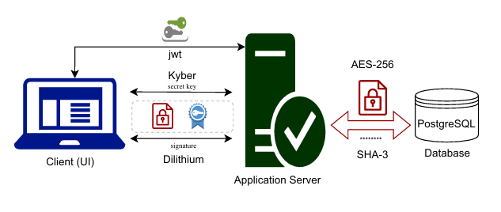
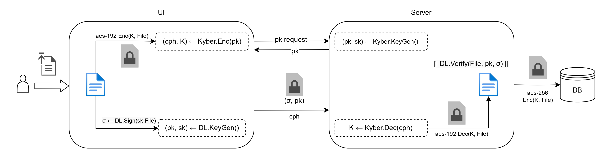
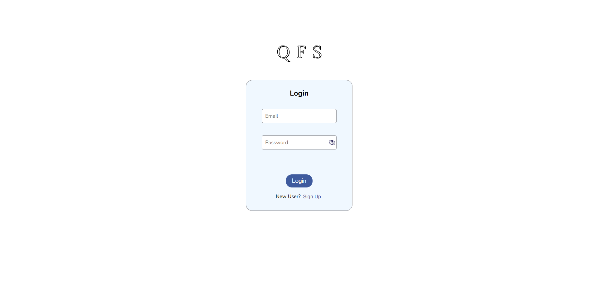
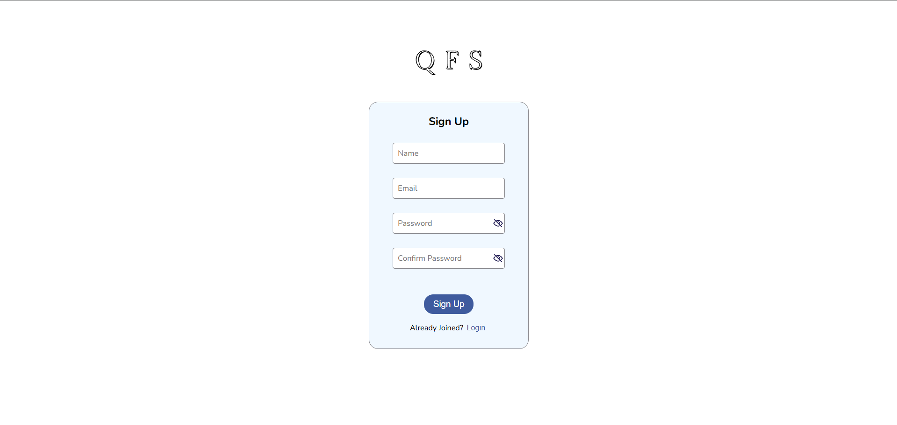
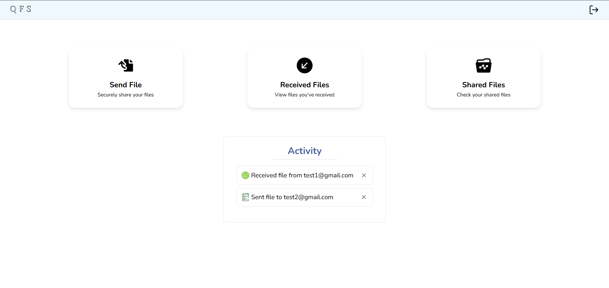
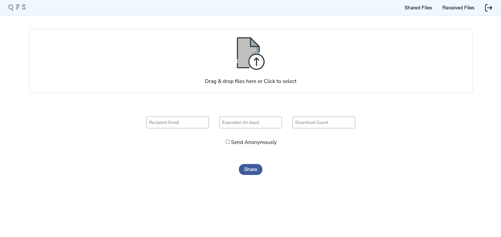
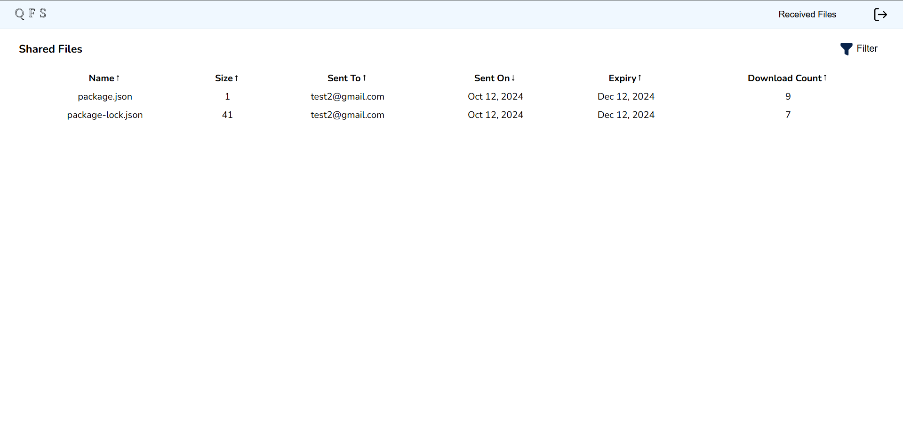
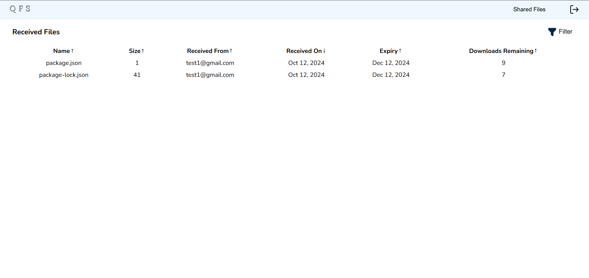

# QFileShare

**QFileShare** is a secure file sharing application that uses Post-Quantum Cryptographic (PQC) techniques to provide strong security against quantum computing threats. It ensures end-to-end encryption and file integrity, offering both security and performance through PQC cryptographic algorithms that are standardized by the *NIST Post-Quantum Cryptography Standardization* process.

## Features

- **Post-Quantum Security**: Implemented state-of-the-art cryptographic methods designed to withstand attacks from quantum computers.
- **Key Exchange**: Uses **Crystals Kyber**, a lattice-based algorithm, for secure and efficient key exchange.
- **Digital Signatures**: Ensures authenticity and integrity with **Crystals Dilithium** digital signatures.
- **File Encryption**: Secures file contents using **AES-256** encryption.
- **Modern Web Stack**:
  - **Frontend**: Built with **Next.js**, providing a fast and responsive user experience.
  - **Backend**: Developed using **FastAPI**, ensuring scalable and efficient API handling.

## Project Structure

```
q-file-share/
├── q-file-share-server/     # Backend code (FastAPI)
└── q-file-share-ui/         # Frontend code (Next.js)
```

## Architecture and Flow Diagrams

The diagram below illustrates the architecture and cryptographic flow of the QFileShare application:



The flow below provides a clear explanation of how file sharing occurs using the quantum protocols Kyber and Dilithium.



## Snapshots of UI

The following diagrams provide snapshots of the different UI components.

<table>
  <tr>
    <td align="center">
      <strong>Login Page</strong><br>
      
    </td>
    <td align="center">
      <strong>Signup Page</strong><br>
      
    </td>
    <td align="center">
      <strong>Dashboard Page</strong><br>
      
    </td>
  </tr>
  <tr>
    <td align="center">
      <strong>Send Files Page</strong><br>
      
    </td>
    <td align="center">
      <strong>Shared Files Page</strong><br>
      
    </td>
    <td align="center">
      <strong>Received Files Page</strong><br>
      
    </td>
  </tr>
</table>

---

## Functionalities

1. **Authentication**:  
   - Authenticate users securely using a username-password combination stored in the database.

2. **File Identification**:  
   - Files are identified by a unique hexadecimal string of 48 characters (24 bytes) generated using SHA-3.
   - This identifier is generated by the server for every file uploaded.

3. **Basic Commands**:  
   - Clients can upload up to 5 encrypted files to the server through the `/send-file` endpoint.

4. **File Encryption**:  
   - Files are encrypted client-side using **AES-256** with a key derived from **Crystals Kyber**.  
   - Integrity is verified using an authentication tag generated with **Crystals Dilithium**.

5. **Server-Side Encryption**:  
   - Files are decrypted and further encrypted server-side using **AES-256** using a key known only to the server.

6. **File Expiration**:  
   - Clients specify an expiration time, or a default maximum expiration (7 days) is applied.
   - Expired files are automatically removed from storage and become inaccessible.

7. **Download Count**:  
   - Clients can specify a maximum download count during upload in the UI.
   - Once the count is exceeded, the file is discarded.

8. **User-Specific File Management**:  
   - Clients can retrieve lists of their shared and received files, along with metadata such as size, upload time, expiration, and download limits. These are accesible at the following endpoints `/shared-file` and `/received-files` respectively.
